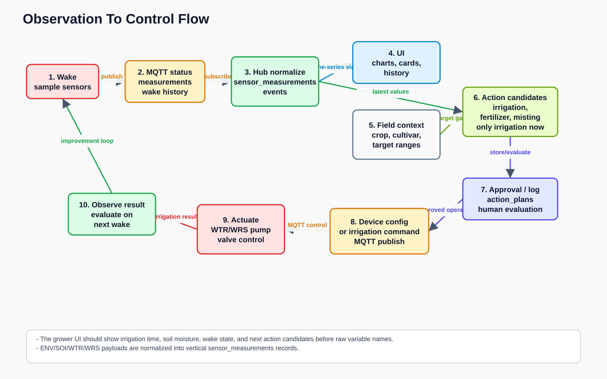
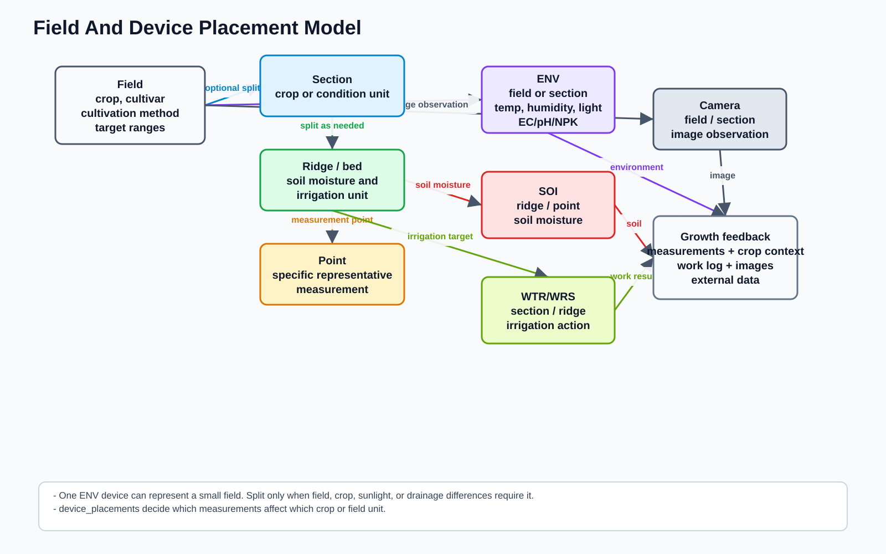
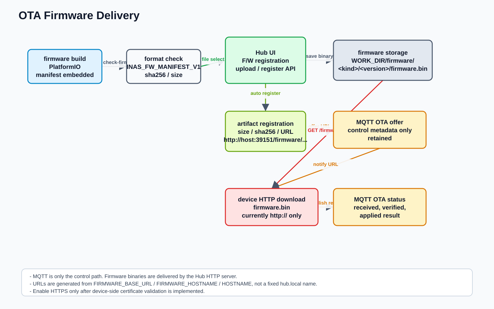

# INAS System Specification

Created: 2026-07-12

This document is the entry point for the INAS system-level specification. It
covers the hub, Cloudflare hosted options, client devices, field data, OTA, and
the agricultural improvement loop.

Japanese version:

- [jp/SYSTEM_SPECIFICATION.md](jp/SYSTEM_SPECIFICATION.md)

draw.io source:

- [assets/inas_system_diagrams.drawio](assets/inas_system_diagrams.drawio)

Regenerate diagrams:

```sh
python3 docs/assets/generate_system_diagrams.py
```

## Purpose

INAS's mission is to **build a society that can once again receive the world's
call**. It should help people notice changes in plants, soil, water, and weather,
verify them in the field, and choose how to respond.

To serve that mission, INAS helps small-scale growers observe irrigation, soil
state, environment, crop context, and work results in one system. Sensor values
and AI proposals are clues that direct attention to the field, not the world
itself or a final answer. The goal is not only device control, but a repeatable
improvement loop: observe, interpret, propose an action, approve or execute it,
evaluate the result, and feed the result back into the next decision. See
[INAS Agentic Agriculture Vision](AGENTIC_AGRICULTURE_VISION.md) for the
canonical product philosophy.

The hub currently executes generic WTR/WRS irrigation. FGT firmware executes a
local, scheduled fertilizer-mixing batch with device-side safety interlocks;
the hub can store its recipe, ingest status, and monitor watering history, while
a farmer-facing FGT recipe/action UI remains future work. Misting/humidity
control, image diagnosis, and external research data integration are also future
extensions.

## System Architecture


| Area | Responsibility |
|---|---|
| local hub | Flask UI/API, MQTT subscribe/publish, OTA HTTP firmware delivery, scheduler, weather recording, storage integration |
| MQTT broker | Device status, runtime config, OTA offer/status, and irrigation command transport |
| WTR | All-in-one watering device for small installations. Handles irrigation, soil moisture, RS485 sensors, and switched 12V sensor power |
| WRS | RS485-first all-in-one watering device. Handles irrigation and treats RS485 soil/PAR/irradiance sensors as the primary sensor bus |
| FGT | Fertilizer mixing and irrigation device. Sequences water, A/B concentrate, mixing, irrigation, and clean-water rinse with local safety interlocks |
| SOI | Battery-powered soil moisture node |
| ENV | 12V RS485 environmental sensor hub |
| Local Hub Turso/libSQL | Existing per-installation operational database and local replica; it is not the Cloud Hub directory or a Cloud tenant DB |
| local/S3 storage | Images, audio, firmware artifacts, logs, and generated outputs |
| Cloud Hub Worker | One shared Cloudflare Worker/frontend that authenticates users and routes each authorized request to one customer DB |
| Cloud directory Turso DB | Tenant status, Access memberships, Edge node registry, and encrypted customer DB credentials; no field telemetry |
| customer Turso DB | One dedicated database per Cloud Hub customer |
| Edge Gateway | Field-side MQTT broker, Wi-Fi AP, config cache, outbox, and HTTPS Sync client; no Turso credentials |
| Cloudflare Access + Tunnel | Access protects Cloud Hub browser APIs; Tunnel remains an optional remote entrance for an independently operated Local Hub |

INAS therefore has two Hub applications with deliberately separate storage.
The existing Local Hub directly controls its devices, may aggregate child Edge
Gateways, and retains its current Turso/libSQL configuration. The Cloud Hub is
one shared Worker at `hub.inas-technologies.com`; it uses a directory DB only to
resolve an authenticated principal, then opens that customer's dedicated Turso
DB. An Edge Gateway chooses exactly one parent, Local Hub or Cloud Hub. MQTT and
safety-critical operation stay on the field LAN and continue during WAN or
parent outages.

Related documents:

- [ARCHITECTURE_LAYERING_POLICY.md](ARCHITECTURE_LAYERING_POLICY.md)
- [hub/doc/NETWORK_ARCHITECTURE.md](../hub/doc/NETWORK_ARCHITECTURE.md)
- [hub/doc/CLOUDFLARE_HOSTED_OPTION.md](../hub/doc/CLOUDFLARE_HOSTED_OPTION.md)
- [hub-cloud/README.md](../hub-cloud/README.md)

## Data And Control Flow



1. A device wakes up and samples sensors.
2. The device publishes status and measurements over MQTT.
3. The hub normalizes payloads into events and time-series measurements.
4. The UI shows farmer-facing summaries first: irrigation history, soil
   moisture, wake history, anomalies, and next action candidates.
5. Field context provides crop name, cultivar, growth stage, cultivation method,
   and target ranges.
6. The hub compares the latest measurements with target ranges and creates
   action candidates such as irrigation, fertilization, or misting.
7. The hypothesis, approval, execution, result, and human evaluation are stored
   for the next cycle.

Automation should be explicit. Supported levels are `observe_only`,
`suggest_only`, `manual_approval`, and `auto`. `auto` must be guarded by limits
such as irrigation maximums, minimum intervals, and device safety conditions.

Related documents:

- [hub/doc/AGRI_IMPROVEMENT_LOOP.md](../hub/doc/AGRI_IMPROVEMENT_LOOP.md)
- [hub/doc/HUB_ADMIN_UX_IMPLEMENTATION.md](../hub/doc/HUB_ADMIN_UX_IMPLEMENTATION.md)

## Device Kinds

Sensor connections and payload schemas are fixed per `device_kind`. INAS does
not use a highly dynamic `capabilities` model for product behavior. When a
device's function changes materially, create a separate project and a separate
`device_kind`. Hardware-only differences, such as supply voltage, MOSFET size,
terminal labels, enclosure, or low-voltage load selection, are hardware
profiles inside an existing `device_kind` when the hub behavior and payload
contract stay the same.

| device_kind | Project | Role | Power assumption |
|---|---|---|---|
| `WTR` | `client-devices/watering-device` | Small-scale all-in-one watering device. Irrigation, soil moisture, RS485, and switched sensor power | Default 12V system with 12V -> 5V conversion. Documented low-voltage hardware profiles remain WTR when the payload contract stays the same |
| `WRS` | `client-devices/watering-rs485-device` | RS485-first all-in-one watering device. Irrigation output plus RS485 soil, PAR, and irradiance sensors on one bus | 12V system. ESP32S3 is powered after 12V -> 5V conversion |
| `FGT` | `client-devices/fertigation-device` | Mixes A/B concentrate into a measured water batch, irrigates, and rinses. Also reads RS485 soil and PAR sensors | 3S battery/12V actuator system with 12V -> 5V conversion for XIAO ESP32-S3 and A/B pumps |
| `SOI` | `client-devices/soil-sensor-device` | Soil moisture node placed at multiple soil points | 18650 battery |
| `ENV` | `client-devices/environment-sensor-device` | RS485 Modbus environmental and soil sensor hub | 12V |

WTR remains important as the personal all-in-one device for building operating
experience. WRS is the stronger all-in-one direction: it keeps the irrigation
outputs local to the device and makes RS485 the sensor expansion boundary. SOI
and ENV implement the direction of separating data collection devices from
action devices. If a small independent watering node has the same local
irrigation-plus-soil-feedback behavior as WTR, define it as a WTR hardware
profile rather than a new device kind.

FGT is separate from WRS because nutrient dosing introduces a materially
different recipe, fault model, and interrupted-batch recovery rule. It never
accepts the generic WTR/WRS immediate irrigation command path; all actuator
changes pass through the FGT state machine. See
[client-devices/fertigation-device/README.md](../client-devices/fertigation-device/README.md).

Crop-specific systems such as strawberry drip cultivation are hub-orchestrated
compositions, not new monolithic device types. An irrigation actuator such as a
plug or pump switch should be paired with a soil moisture feedback sensor at
the same bed, ridge, or representative point so the hub can verify that
irrigation actually increased root-zone moisture.

WRS is intentionally composable at the RS485 layer. PAR, irradiance, soil
moisture, EC, pH, and NPK sensors should be added as Modbus devices with unique
slave IDs on the same bus. A missing sensor is represented by timeout or
`*_ok=false`, not by changing XIAO pin assignments or creating a new wiring
variant.

MOSFET-switched outputs are managed as named output inventory in runtime
config. `mosfet_switches` maps a stable `switch_id` to a farmer-facing `name`,
physical `terminal`, optional `controlled_load`, and the `channel_mask` used by
scheduled irrigation when applicable. This lets the hub show "strawberry drip
line A" while firmware still controls only generic electrical outputs.

Related documents:

- [client-devices/docs/rs485_sensor_device_spec.md](../client-devices/docs/rs485_sensor_device_spec.md)
- [client-devices/docs/firmware_layering_policy.md](../client-devices/docs/firmware_layering_policy.md)
- [client-devices/docs/pin_assignments.md](../client-devices/docs/pin_assignments.md)
- [client-devices/README.md](../client-devices/README.md)
- [CULTIVATION_SYSTEM_ORCHESTRATION.md](CULTIVATION_SYSTEM_ORCHESTRATION.md)

## Field And Device Placement



Field data defines which crop and area a measurement should affect.

| Unit | Use |
|---|---|
| field | Whole field. ENV, wide camera, weather, and overall environmental values |
| section | Area with different crop or cultivation conditions |
| ridge / bed | Irrigation and soil moisture management unit |
| point | Specific measurement point for soil moisture, EC, pH, light, or similar values |

For a small field, one ENV device can represent the whole field. Split into
sections, ridges, beds, or points only when crop differences, sunlight, drainage,
or field size require it. `device_placements` defines which field unit each ENV,
SOI, WTR, WRS, or camera represents.

Field settings should support crop name, cultivar, growth stage, sowing date,
transplanting date, target harvest date, cultivation method, soil/media, plant
count, target ranges, control policy, reference URLs, and observation notes.

## Data Model

Time-series measurements should not be forced into only fixed columns. Use a
measurement definition table plus a vertical measurement table.

| Data | Role |
|---|---|
| device status / events | Wake, measurement, irrigation, OTA, and error history |
| sensor_measurement_definitions | Metric definitions such as `soil_moisture_percent`, `soil_ec_us_cm`, and `par_umol_m2_s` |
| sensor_measurements | `device_id`, `device_kind`, `measured_at`, `metric`, `value`, `unit`, `quality`, and raw payload |
| field profiles | Crop, cultivar, growth stage, cultivation method, target ranges, and control policy |
| device_placements | Links devices to field, section, ridge/bed, or point |
| action_plans | Action candidate, approval, execution, and evaluation history |
| firmware artifacts | OTA target firmware metadata: `device_kind`, version, size, sha256, and URL |

The UI should not expose variable names or raw JSON as the primary experience.
Farmer-facing screens should focus on irrigation, soil moisture, wake state,
anomalies, crop state, and next action candidates. Raw payloads belong in detail
views.

## OTA



OTA separates control transport from binary delivery.

| Path | Responsibility |
|---|---|
| MQTT | OTA offer, OTA status, and legacy request/reply control messages |
| HTTP | Firmware binary download |
| hub storage | `WORK_DIR/firmware/<device_kind>/<version>/firmware.bin` |

The firmware upload/register API calculates size and sha256 during upload and
registers an artifact. Artifact URL generation prefers `FIRMWARE_BASE_URL`; if
it is not set, the hub builds an HTTP URL from `FIRMWARE_HOSTNAME`, OS
`HOSTNAME`, or the OS hostname plus `FIRMWARE_PORT` / `HUB_HTTP_PORT`.

Current device firmware accepts only `http://` OTA download URLs. Cloudflare
Access HTTPS hostnames are for the hub UI, not for firmware downloads. Enable
HTTPS OTA only after certificate validation is implemented on the device side.

Related documents:

- [client-devices/watering-device/docs/ota_update_spec.md](../client-devices/watering-device/docs/ota_update_spec.md)
- [client-devices/watering-device/docs/ota_implementation_traceability.md](../client-devices/watering-device/docs/ota_implementation_traceability.md)

## Authentication And Authorization

Cloud Hub browser APIs validate the Cloudflare Access assertion issuer,
audience, signature, and email, then require an active membership for the
requested public tenant ID. Edge Sync uses a separate one-time node bearer:
the directory stores only its salted digest and resolves the tenant from the
registered node. Neither request type may provide a database URL, token, or
internal tenant ID.

Local Hub Access/Tunnel remains independent and keeps its existing local
authorization behavior. A Cloudflare, Turso Platform, directory, or customer DB
credential must never be placed in an Edge Gateway QR code or configuration.

## Operational Assumptions

- The default local hub HTTP port is `39151`.
- The Tunnel option defaults `CLOUDFLARE_TUNNEL_ORIGIN_URL` to
  `http://127.0.0.1:39151`.
- An optional Local Hub Tunnel connector runs on the Local Hub side.
- Cloud Hub uses one Worker custom domain and public paths of the form
  `/t/<random-public-tenant-id>/`.
- Every Cloud Hub customer has one dedicated Turso DB; Workers are not created
  per customer.
- Client firmware is built on Linux or WSL2.
- PlatformIO projects are split by device kind.
- Shared client code lives in `client-devices/common/lib/ina-client-common`.
- Run `make check-firmware` after firmware build and before OTA registration.

## Change Policy

When adding functionality:

1. Apply [ARCHITECTURE_LAYERING_POLICY.md](ARCHITECTURE_LAYERING_POLICY.md) and decide which layer owns the decision.
2. Decide which `device_kind` owns the behavior. Do not hide product differences
   behind a dynamic capabilities model.
3. Decide whether the data belongs to the whole field, section, ridge/bed, or
   measurement point.
4. For measurements, add definitions and store time-series values through
   `sensor_measurements`.
5. For actions, store proposal, approval, execution, and evaluation history.
6. Keep the primary UI farmer-facing; move raw JSON to detail screens.
7. Preserve the Local Hub's own database and direct-control boundary. In Cloud
   Hub, resolve the authenticated membership/node through the directory and
   route only to that customer's dedicated DB.

## Related Documents

- [hub/README.md](../hub/README.md)
- [client-devices/README.md](../client-devices/README.md)
- [ARCHITECTURE_LAYERING_POLICY.md](ARCHITECTURE_LAYERING_POLICY.md)
- [hub/doc/AI_AGENT_ENVIRONMENT_SETUP.md](../hub/doc/AI_AGENT_ENVIRONMENT_SETUP.md)
- [hub/doc/ENVIRONMENT.md](../hub/doc/ENVIRONMENT.md)
- [hub/doc/OPERATIONS.md](../hub/doc/OPERATIONS.md)
- [hub-cloud/docs/SECURITY.md](../hub-cloud/docs/SECURITY.md)
