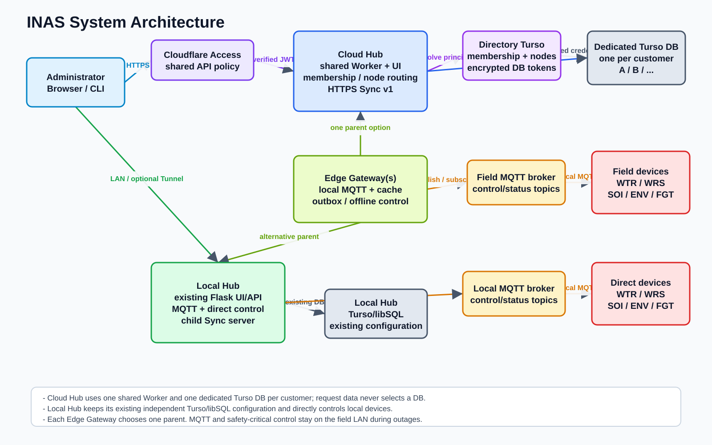

# INAS

英語版: [../../README.md](../../README.md)

INASは、圃場環境の観測、潅水設備の運用、機器設定・ファームウェアの管理、
農作業結果の記録をまとめて扱う農業プラットフォームです。このモノレポには、
ESP32-S3機器のファームウェア、Local Hub、圃場側Edge Gateway、共有Cloud Hub、
共通契約、Extension、利用者向けドキュメントが含まれています。

MQTT通信と安全に関わる機器制御は、圃場内のLANで継続できるよう設計しています。
機器をLocal Hubから直接運用する構成と、Edge Gatewayから1つの親Local Hubまたは
Cloud HubへHTTPSで同期する構成を選べます。

## 主要ドキュメント

- [SYSTEM_SPECIFICATION.md](SYSTEM_SPECIFICATION.md): INAS 全体仕様。hub、Cloudflare、デバイス種別、圃場データ、OTA の関係をまとめる。
- [ARCHITECTURE_LAYERING_POLICY.md](ARCHITECTURE_LAYERING_POLICY.md): hub、firmware、contract、storage、UI、adapter の全体レイヤ境界。
- [DEVICE_DEFINITION_SPECIFICATION.md](DEVICE_DEFINITION_SPECIFICATION.md): 各ファームウェアが Hub へ伝えるデバイスの決まり事、定義駆動 UI、Runtime Config、既存 DB との互換方針。
- [EXTENSION_SPECIFICATION.md](EXTENSION_SPECIFICATION.md): 機能別フォルダから取り込む宣言型Extensionと、安全なUI拡張位置の仕様。
- [EXTENSION_SECURITY_REVIEW_POLICY.md](EXTENSION_SECURITY_REVIEW_POLICY.md): 第三者Extensionの隔離、静的検査、AI補助監査、ユーザ承認方針。
- [DISCORD_NOTIFICATION_DESIGN.md](DISCORD_NOTIFICATION_DESIGN.md): 通知疲れを抑えるDiscordカード、Cloudflare限定の確認画面リンク、管理者設定の設計。
- [CULTIVATION_SYSTEM_ORCHESTRATION.md](CULTIVATION_SYSTEM_ORCHESTRATION.md): イチゴ点滴栽培のような作物別システムを、複数デバイスと hub のオーケストレーションとして扱う設計方針。
- [AGENTIC_AGRICULTURE_VISION.md](AGENTIC_AGRICULTURE_VISION.md): 人・固定設備・ロボットを段階的に組み合わせ、判断、実行、確認、学習を循環させるエージェンティック農耕の思想と判断基準。
- [FUTURE_FEATURES.md](FUTURE_FEATURES.md): 検討中・一部提供・条件待ちの将来機能と、コミュニティ提案を公開台帳へ追加する方針。
- [../../hub/doc/jp/README.md](../../hub/doc/jp/README.md): hub の日本語ドキュメント入口。
- [../../client-devices/docs/jp/README.md](../../client-devices/docs/jp/README.md): client device firmware と配線・製造ドキュメントの日本語入口。

## システム概要



```text
INAS機器 -- MQTT --> Local Hub

INAS機器 -- MQTT --> Edge Gateway -- Sync v1 HTTPS --> Local Hub または Cloud Hub
```

Hubは、機器状態、計測値、潅水履歴、圃場・作物情報、作業記録、Runtime Config、
OTA更新を1つの管理画面にまとめます。全体構成、データフロー、各機器の役割、
保存先の境界、現在の対応範囲は
[INAS全体仕様](SYSTEM_SPECIFICATION.md)を参照してください。

## リポジトリ構成

| パス | 役割 |
|---|---|
| [`hub/`](../../hub/doc/jp/README.md) | Local Hub。Flask UI/API、MQTT処理、スケジューラ、ストレージ連携、OTA配信 |
| [`hub-cloud/`](../../hub-cloud/README.md) | Cloudflare Workers上の共有Cloud Hub。認証済みテナントルーティングと顧客別DB |
| [`edge-gateway/`](../../edge-gateway/README.md) | 圃場側アプライアンス。ローカルMQTT、設定キャッシュ、永続Outbox、親Hubとの同期 |
| [`client-devices/`](../../client-devices/docs/jp/README.md) | WTR、WRS、FGT、SOI、ENVのPlatformIOファームウェアと共通ライブラリ |
| [`shared/`](../../shared/README.md) | HubとGatewayで共有するSync契約とPython edge runtime |
| [`extensions/`](../../extensions/README.md) | ビルド時に取り込む宣言型Hub UI Extension |
| [`docs-site/`](../../docs-site/README.md) | 利用者向けのセットアップ・運用・トラブルシューティングサイト |
| [`docs/`](../README.md) | プロジェクト横断仕様、architecture policy、編集可能なシステム図 |
| [`lp/`](../../lp/README.md) | 製品ランディングページとデプロイ用アセット |
| [`pitch-deck/`](../../pitch-deck/) | 製品説明資料のソースと生成物 |

## インストールと初回起動

このリポジトリには複数の独立したコンポーネントがあり、リポジトリ全体を一括で
インストールするコマンドはありません。利用するコンポーネントのディレクトリで
依存関係をインストールしてください。

### 必要な開発環境

- Git
- Local Hub、Edge Gateway、共通Python runtime用のPython 3.11以降と
  [uv](https://docs.astral.sh/uv/getting-started/installation/)
- Cloud Hub、管理UI、ドキュメントサイト、製品Webアセット用のNode.js 22とnpm
- 機器ファームウェア用のLinuxまたはWSL2、GNU Make、PlatformIO

機器ファームウェアはPlatformIOローカルライブラリをシンボリックリンクで参照します。
Windowsネイティブでのビルドはサポートしていません。WSL2を使用し、
`/mnt/c`配下ではなくLinux側のファイルシステムへcloneしてください。

### リポジトリをcloneする

```bash
git clone https://github.com/inastechnology/inas.git
cd inas
```

### Local Hubを起動する

```bash
cd hub
uv sync
uv run ina-hub install
uv run python src/ina_device_hub/serve.py
```

標準のURLは`http://localhost:39151`です。インストールコマンドは対話形式で
Hubの環境設定を作成します。MQTT、データベース、オブジェクトストレージ、
Cloudflare、本番サービスの設定は
[Hubドキュメント](../../hub/doc/jp/README.md)と
[Hub運用手順](../../hub/doc/jp/OPERATIONS.md)を参照してください。

### 機器ファームウェアをビルドする

次はWTR水やり機器をビルドする例です。

```bash
cd client-devices/watering-device
cp default.env.user.ini .env.user.ini
make build
```

開発機へ書き込む場合は`make upload`、配布用イメージを作る場合は
`make merged-bin`を実行します。ハードウェア準備、配線、機器別ビルド、
製造手順は[機器ドキュメント](../../client-devices/docs/jp/README.md)から
参照してください。

### その他のコンポーネントを開始する

| 目的 | 最初の依存関係インストール | 詳細 |
|---|---|---|
| Edge Gatewayを開発する | `cd edge-gateway && uv sync --frozen` | [Edge Gateway README](../../edge-gateway/README.md) |
| Cloud Hubを開発・テストする | `cd hub-cloud && npm ci` | [Cloud Hub README](../../hub-cloud/README.md) |
| 公開ドキュメントをプレビューする | `cd docs-site && npm ci && npm run dev` | [ドキュメントサイトREADME](../../docs-site/README.md) |
| Hub管理UIをビルドする | `cd hub/admin-ui && npm ci && npm run build` | [Hub README](../../hub/README.md) |

## ドキュメント

セットアップ、設定、日常運用、ファームウェア更新、トラブルシューティングは、
利用者向けの[INASドキュメント](https://docs.inas-technologies.com/)から
参照してください。ソースとローカルプレビュー手順は
[`docs-site/`](../../docs-site/README.md)にあります。

開発者向けの詳細は、このREADMEへ実装情報を追加するのではなく、次の文書を
参照してください。

- [INAS全体仕様](SYSTEM_SPECIFICATION.md)
- [アーキテクチャレイヤリングポリシー](ARCHITECTURE_LAYERING_POLICY.md)
- [Device Definition仕様](DEVICE_DEFINITION_SPECIFICATION.md)
- [Hub Extension仕様](EXTENSION_SPECIFICATION.md)
- [Edge Gatewayハードウェア・ID仕様](EDGE_GATEWAY_HARDWARE_AND_IDENTITY.md)
- [開発者ドキュメント索引（英語）](../README.md)

依存関係、環境変数、テスト、デプロイ、セキュリティ注意事項はコンポーネントごとに
管理しています。変更やデプロイの前に、対象ディレクトリのREADMEを確認し、その
ディレクトリでコマンドを実行してください。実際のデータベーストークン、MQTT認証情報、
Cloudflare secret、機器認証情報、本番用生成設定はcommitしないでください。
