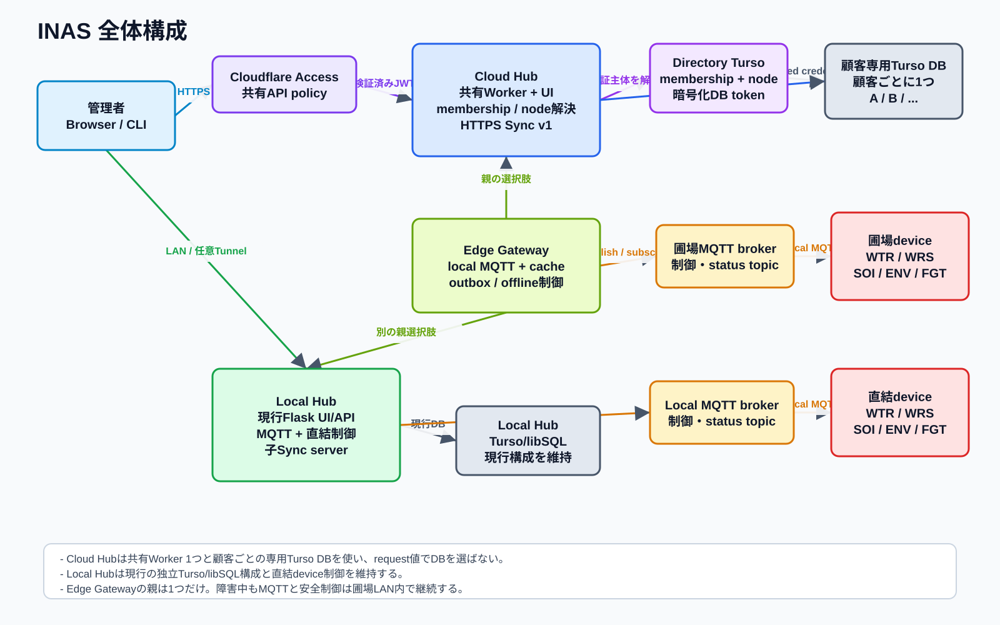
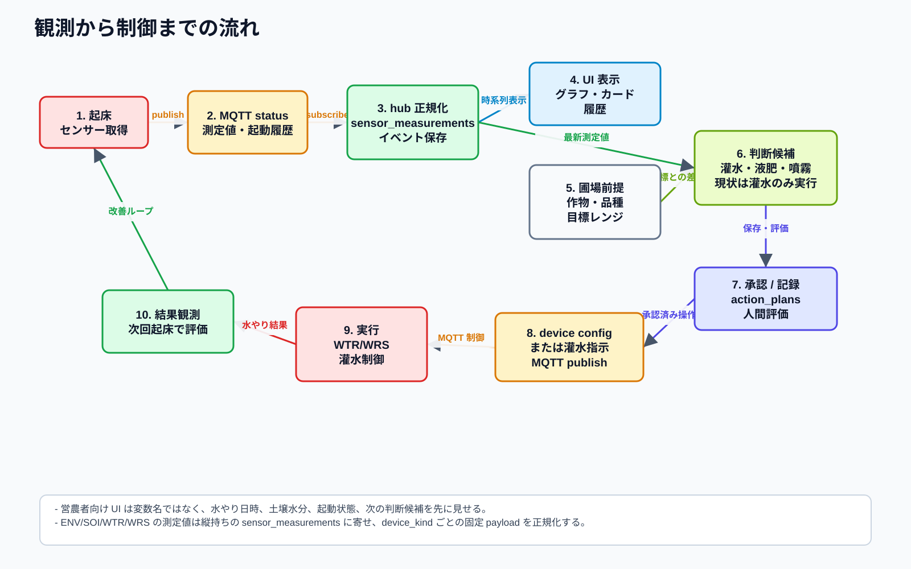
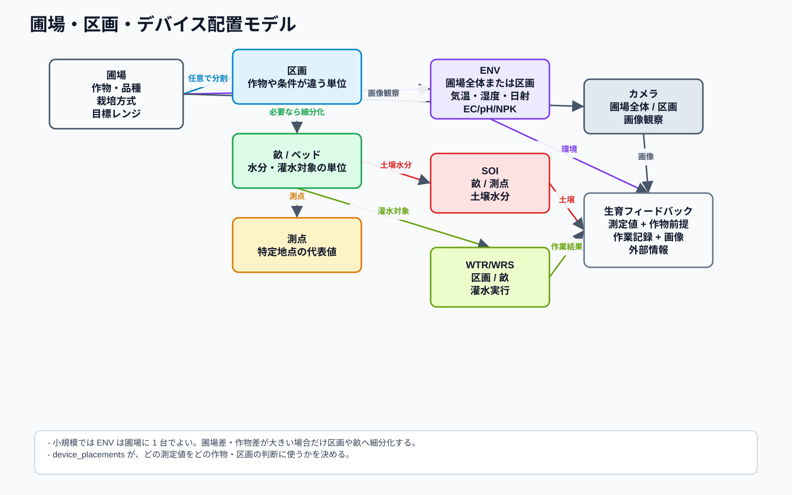
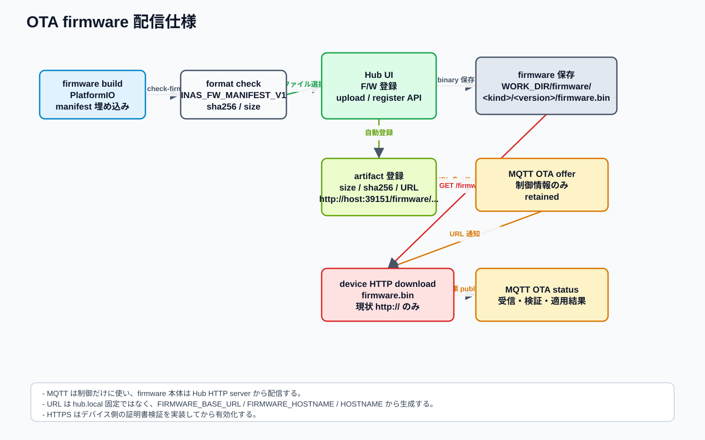

# INAS 全体仕様

作成日: 2026-07-12

この文書は、INAS の hub、Cloudflare hosted option、client device、圃場データ、OTA、改善ループを横断して説明する入口仕様である。詳細な実装仕様は各リンク先を正とし、この文書では全体像、責務分担、現在の運用前提をまとめる。

draw.io 編集元:

- [assets/inas_system_diagrams.drawio](assets/inas_system_diagrams.drawio)

図の再生成:

```sh
python3 docs/assets/generate_system_diagrams.py
```

## 目的

INAS は、小規模な営農者が水やり、土壌状態、環境状態、作物前提、作業結果を一つの文脈で確認し、次のアクションを科学的に判断するためのシステムである。

現時点で hub から実行できる制御は WTR/WRS の灌水である。将来は液肥、噴霧、画像診断、外部研究データの参照を追加する。ただし、最初から自動化しすぎず、観察、提案、承認、実行、評価の記録を積み上げることを優先する。

## 全体構成



主要構成要素:

| 領域 | 役割 |
|---|---|
| local hub | Flask UI/API、MQTT subscribe/publish、OTA HTTP 配信、タイムラプス、天気取得、ストレージ連携を担当する常駐プロセス |
| MQTT broker | デバイスの status、runtime config、OTA offer/status、灌水指示などの制御経路 |
| WTR | 水やり全部入りデバイス。潅水、土壌水分、RS485 センサー、12V センサー電源 MOSFET を持つ |
| WRS | RS485 前提の水やり全部入りデバイス。灌水と RS485 土壌/PAR/日射センサーを同じ bus で扱う |
| SOI | 18650 バッテリー前提の土壌水分専用ノード |
| ENV | 12V 電源前提の RS485 環境センサーデバイス |
| Turso/libSQL | Cloud app 版や同期境界で使う共有 DB |
| ローカル/S3 ストレージ | 画像、音声、firmware artifact、ログなどの保存先 |
| Cloudflare Access + Tunnel | local hub を認可付きで外部から操作する入口 |
| Cloudflare Workers + Hono | Cloud app 版の HTTP API/UI。local hub の全機能を置き換えない |

基本運用は local hub である。Cloudflare Tunnel 版は、デバイス側で起動している local hub を Cloudflare Access 越しに公開する。Workers 版は Turso を境界にした hosted 管理 API/UI から始め、MQTT 常時購読、カメラ、ffmpeg、ローカルファイル処理は local hub に残す。

関連仕様:

- [ARCHITECTURE_LAYERING_POLICY.md](ARCHITECTURE_LAYERING_POLICY.md)
- [hub/doc/jp/NETWORK_ARCHITECTURE.md](../../hub/doc/jp/NETWORK_ARCHITECTURE.md)
- [hub/doc/jp/CLOUDFLARE_HOSTED_OPTION.md](../../hub/doc/jp/CLOUDFLARE_HOSTED_OPTION.md)
- [hub/doc/jp/CLOUDFLARE_CLOUD_APP_IMPLEMENTATION.md](../../hub/doc/jp/CLOUDFLARE_CLOUD_APP_IMPLEMENTATION.md)

## 観測から制御まで



基本フロー:

1. デバイスが起床し、センサー値と起動状態を取得する。
2. デバイスは MQTT status として測定値を publish する。
3. hub は payload を正規化し、イベントと時系列測定値として保存する。
4. UI は水やり日時、土壌水分、起動履歴、異常、次の判断候補を営農者向けの言葉で表示する。
5. 圃場に登録された作物名、品種、生育段階、栽培方式、目標レンジを前提にする。
6. hub は最新値と目標レンジの差から、灌水、液肥、噴霧などの判断候補を作る。
7. 実施前の仮説、承認、実施、結果、人間評価を記録し、次の判断へ反映する。

現状の自動制御は慎重に扱う。`observe_only`、`suggest_only`、`manual_approval`、`auto` の段階を明確にし、`auto` は灌水上限、間隔、安全条件を設定してから使う。

関連仕様:

- [hub/doc/jp/AGRI_IMPROVEMENT_LOOP.md](../../hub/doc/jp/AGRI_IMPROVEMENT_LOOP.md)
- [hub/doc/jp/HUB_ADMIN_UX_IMPLEMENTATION.md](../../hub/doc/jp/HUB_ADMIN_UX_IMPLEMENTATION.md)

## デバイス種別

device kind ごとに接続センサーと payload schema を固定する。`capabilities` で過度に可変にせず、機能が変わる場合は別プロジェクトと別 `device_kind` を作る。電源電圧、MOSFET 容量、端子ラベル、筐体、低電圧負荷の選定のような H/W だけの差異は、hub の挙動と payload contract が同じなら既存 `device_kind` の H/W profile として扱う。

| device_kind | プロジェクト | 主用途 | 電源前提 |
|---|---|---|---|
| `WTR` | `client-devices/watering-device` | 小規模向け全部入り水やり機。灌水制御、土壌水分、RS485、センサー電源 MOSFET | 既定は 12V 系で、ESP32S3 は 12V -> 5V DCDC 後に給電。payload contract が同じ低電圧 H/W profile も WTR として扱う |
| `WRS` | `client-devices/watering-rs485-device` | RS485 前提の全部入り水やり機。灌水出力と RS485 土壌/PAR/日射センサーを同一 bus で扱う | 12V 系を前提。ESP32S3 は 12V -> 5V DCDC 後に給電 |
| `SOI` | `client-devices/soil-sensor-device` | 土壌に複数設置する土壌水分専用ノード | 18650 バッテリー |
| `ENV` | `client-devices/environment-sensor-device` | RS485 Modbus の環境・土壌複合センサー、日射/PAR センサー | 12V |

WTR は個人用の全部入りデバイスとして実績を積むために残す。WRS はよりマッチョな全部入りの方向で、灌水出力はデバイス内に持ち、センサー拡張境界を RS485 bus に固定する。SOI/ENV は、データ取得デバイスとアクションデバイスを分ける方針の実装である。土壌フィードバックと低電圧の水やり出力を同じ小型ノードに置く場合も、WTR と同じ local irrigation + soil feedback の責務なら WTR の H/W profile として扱い、新しい device kind は作らない。

イチゴ点滴栽培のような作物別システムは、新しい巨大な単一デバイスではなく、hub が複数デバイスを束ねる構成として扱う。プラグやポンプスイッチのような灌水アクチュエータは、同じベッド、畝、または代表測点の土壌水分センサーとペアにし、灌水によって根域水分が実際に増えたかを hub が検証できるようにする。

WRS は RS485 層でコンポーサブルにする。PAR、日射、土壌水分、EC、pH、NPK などは同じ bus 上の Modbus device として追加し、slave id を重複させない。未接続センサーは timeout または `*_ok=false` として表現し、XIAO の pin assignment を変更したり配線 variant を増やしたりしない。

MOSFET で切り替える出力は、runtime config の出力台帳として名前を管理する。`mosfet_switches` は安定した `switch_id`、営農者向けの `name`、物理 `terminal`、任意の `controlled_load`、灌水予約で使う `channel_mask` を紐づける。hub は「イチゴ点滴ライン A」のように表示できるが、firmware は汎用の電気出力を制御するだけでよい。

関連仕様:

- [client-devices/docs/jp/rs485_sensor_device_spec.md](../../client-devices/docs/jp/rs485_sensor_device_spec.md)
- [client-devices/docs/jp/firmware_layering_policy.md](../../client-devices/docs/jp/firmware_layering_policy.md)
- [client-devices/docs/jp/pin_assignments.md](../../client-devices/docs/jp/pin_assignments.md)
- [client-devices/docs/jp/README.md](../../client-devices/docs/jp/README.md)
- [CULTIVATION_SYSTEM_ORCHESTRATION.md](CULTIVATION_SYSTEM_ORCHESTRATION.md)

## 圃場とデバイス配置



圃場データは、測定値をどの作物・区画の判断に使うかを決める前提である。

| 単位 | 用途 |
|---|---|
| field | 圃場全体。ENV、広域カメラ、天気、全体環境の代表値 |
| section | 作物や栽培条件が違う区画 |
| ridge / bed | 畝・ベッド。SOI の土壌水分や WTR/WRS の灌水対象 |
| point | 特定地点の測定値。水分、EC、pH、日射などの測点 |

小規模な圃場では ENV は圃場に 1 台でよい。圃場差、日当たり、水はけ、作物差が大きい場合だけ区画や畝へ細分化する。`device_placements` は、ENV/SOI/WTR/WRS/カメラなどのデータをどの圃場単位に紐づけるかを表す。

圃場は最初に、名前、都道府県、市区町村、町名・地区、屋外/ハウス内/屋内などの設置環境を基本情報として登録する。新規作成時にはデバイスや圃場内配置を設定しない。

作成後の栽培設定には、作物名、品種、生育段階、播種日、定植日、収穫目標、栽培方式、土壌/培地、株数、目標レンジ、制御方針、参考 URL、観察メモを登録できるようにする。生育段階と栽培方式は定義済み候補から選択し、作物と品種は自由入力と候補提示を併用する。

## データモデル

時系列測定値は固定カラムだけに押し込まず、測定項目定義と測定値を分ける。

主要データ:

| データ | 役割 |
|---|---|
| device status / events | 起床、測定、灌水、OTA、エラーなどの履歴 |
| sensor_measurement_definitions | `soil_moisture_percent`、`soil_ec_us_cm`、`par_umol_m2_s` などの測定項目定義 |
| sensor_measurements | device_id、device_kind、measured_at、metric、value、unit、quality、raw payload |
| field location | 圃場名、都道府県、市区町村、町名・地区、設置環境 |
| field profiles | 作物、品種、生育段階、栽培方式、目標レンジ、制御方針 |
| device_placements | デバイスを圃場全体、区画、畝、測点へ紐づける |
| action_plans | 判断候補、承認、実施、評価の履歴 |
| firmware artifacts | OTA 対象 firmware の device_kind、version、size、sha256、URL |

UI では、データ構造や変数名をそのまま見せない。営農者が見る画面は、水やり、土壌水分、起床、異常、作物状態、次の判断候補を中心にする。詳細な JSON や raw payload は詳細画面に寄せる。

## OTA 仕様



OTA は MQTT と HTTP の役割を分ける。

| 経路 | 役割 |
|---|---|
| MQTT | OTA offer、status、旧 request/reply 互換などの制御情報 |
| HTTP | firmware binary 本体の download |
| hub storage | `WORK_DIR/firmware/<device_kind>/<version>/firmware.bin` の保存 |

firmware upload/register API は、upload 時に size と sha256 を自動計算し、artifact を登録する。artifact URL は `FIRMWARE_BASE_URL` があれば優先し、未設定なら `FIRMWARE_HOSTNAME`、OS `HOSTNAME`、OS hostname と `FIRMWARE_PORT` / `HUB_HTTP_PORT` から組み立てる。

現状の device firmware は OTA download で `http://` のみ受け付ける。Cloudflare Access の HTTPS hostname は hub UI 用であり、OTA firmware download URL には使わない。HTTPS 対応は、デバイス側に証明書検証を入れてから行う。

関連仕様:

- [client-devices/watering-device/docs/jp/ota_update_spec.md](../../client-devices/watering-device/docs/jp/ota_update_spec.md)
- [client-devices/watering-device/docs/jp/ota_implementation_traceability.md](../../client-devices/watering-device/docs/jp/ota_implementation_traceability.md)

## 認証認可

Cloudflare hosted option の入口は Cloudflare Access とする。許可 email は Access rule group を source of truth とし、スクリプトから追加・削除する。

Cloud app 版では、Worker 側でも `Cf-Access-Jwt-Assertion` を検証し、`issuer`、`audience`、`email` を確認する。アプリ内権限は Turso の `admin_users` で `reader`、`operator`、`admin` を扱う。

`CLOUDFLARE_ACCESS_API_TOKEN` は resource 作成スクリプト用の secret であり、Worker には渡さない。`.env` は環境の source of truth だが、secret をログやドキュメントへ出力しない。

## 運用前提

local hub:

- 既定 HTTP port は `39151`。
- Tunnel 版の `CLOUDFLARE_TUNNEL_ORIGIN_URL` 既定は `http://localhost:39151`。
- Tunnel はデバイス側で起動する。
- Cloudflare Error 1033 は、DNS/Access ではなく Tunnel connector 停止をまず疑う。

開発:

- client firmware は Linux / WSL2 で build する。
- PlatformIO project は device kind ごとに分ける。
- 共有コードは `client-devices/common/lib/ina-client-common` に置く。
- F/W 生成後は `make check-firmware` で manifest を確認してから OTA 登録する。

## 変更方針

新しい機能を追加する場合は、次の順で整理する。

1. [ARCHITECTURE_LAYERING_POLICY.md](ARCHITECTURE_LAYERING_POLICY.md) に沿って、どの layer が判断を持つかを決める。
2. どの device_kind の責務かを決める。可変 capabilities で逃がさない。
3. 圃場全体、区画、畝、測点のどこに紐づくデータかを決める。
4. 測定値なら `sensor_measurement_definitions` と `sensor_measurements` に載せる。
5. アクションなら、提案、承認、実行、評価の履歴を残す。
6. UI は営農者向けサマリを先に出し、raw JSON は詳細へ置く。
7. Cloudflare hosted option は local hub を壊さず、Turso を境界に段階的に追加する。

## 関連ドキュメント

- [hub/doc/jp/README.md](../../hub/doc/jp/README.md)
- [client-devices/docs/jp/README.md](../../client-devices/docs/jp/README.md)
- [ARCHITECTURE_LAYERING_POLICY.md](ARCHITECTURE_LAYERING_POLICY.md)
- [hub/doc/jp/AI_AGENT_ENVIRONMENT_SETUP.md](../../hub/doc/jp/AI_AGENT_ENVIRONMENT_SETUP.md)
- [hub/doc/jp/ENVIRONMENT.md](../../hub/doc/jp/ENVIRONMENT.md)
- [hub/doc/jp/OPERATIONS.md](../../hub/doc/jp/OPERATIONS.md)
