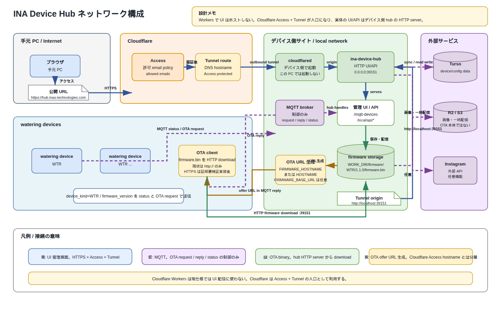

# INA Device Hub ネットワーク構成

この図は、Cloudflare Tunnel 版の運用構成を示します。Cloudflare Workers で hub UI をホストするのではなく、Cloudflare Access + Tunnel を入口にして、デバイス側で起動している local hub HTTP server へ転送します。

## 接続の読み方

- 青: 手元 PC から Cloudflare Access / Tunnel を通って、デバイス側 hub UI/API に到達する管理画面経路。
- 紫: MQTT broker を使う制御経路。OTA request / reply / status を扱い、firmware binary 本体は MQTT で送らない。
- 緑: OTA firmware binary の HTTP download 経路。デバイスは hub HTTP server の `/firmware/<device_kind>/<version>/firmware.bin` から取得する。
- 黄: OTA offer URL の生成経路。`FIRMWARE_BASE_URL` があれば優先し、未設定なら `FIRMWARE_HOSTNAME`、OS `HOSTNAME`、OS hostname と `FIRMWARE_PORT` / `HUB_HTTP_PORT` から `http://...:39151` を組み立てる。

## 重要な前提

- Tunnel はデバイス側で起動する。この PC では起動しない。
- `CLOUDFLARE_TUNNEL_ORIGIN_URL` の既定は `http://localhost:39151`。
- Cloudflare Access の public hostname は UI 用の HTTPS/認証付き入口であり、現状の OTA firmware download URL には使わない。
- 現状の device firmware は OTA download で `http://` のみ受け付ける。HTTPS はデバイス側に証明書検証を入れてから有効化する。
- Cloudflare Workers は現仕様では hub UI 配信に使わない。Cloud app 版は別の hosted 管理アプリとして扱う。
