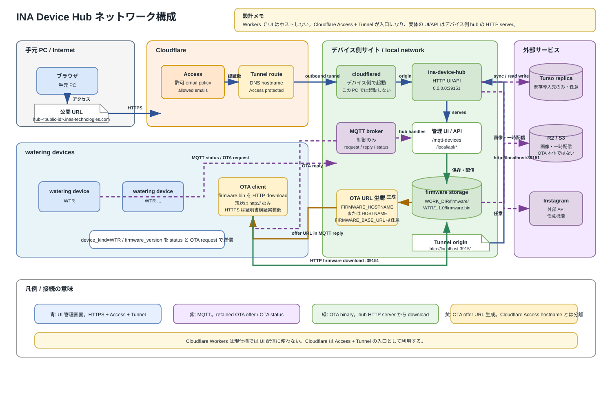

# INA Device Hub ネットワーク構成

この図は現行Local Hubへ遠隔接続する任意構成だけを示します。Cloudflare
Access + Tunnelから、そのLocal Hub HTTP serverへ転送しても、Local Hubの
Turso/libSQL構成は変わりません。共有Cloud HubとEdge Gatewayの経路は
[`../../../hub-cloud/`](../../../hub-cloud/README.md)を参照してください。

## 接続の読み方

- 青: 手元 PC から Cloudflare Access / Tunnel を通って、デバイス側 hub UI/API に到達する管理画面経路。
- 紫: MQTT broker を使う制御経路。Hub からデバイスへの retained OTA offer と、デバイスから Hub への OTA status を扱い、firmware binary 本体は MQTT で送らない。OTA request / reply は旧 firmware 互換用途のみ。
- 緑: OTA firmware binary の HTTP download 経路。デバイスは hub HTTP server の `/firmware/<device_kind>/<version>/firmware.bin` から取得する。
- 黄: OTA offer URL の生成経路。`FIRMWARE_BASE_URL` があれば優先し、未設定なら `FIRMWARE_HOSTNAME`、OS `HOSTNAME`、OS hostname と `FIRMWARE_PORT` / `HUB_HTTP_PORT` から `http://...:39151` を組み立てる。

## 重要な前提

- Tunnel はデバイス側で起動する。この PC では起動しない。
- `CLOUDFLARE_TUNNEL_ORIGIN_URL` の既定は `http://127.0.0.1:39151`。
- Cloudflare Access の public hostname は UI 用の HTTPS/認証付き入口であり、現状の OTA firmware download URL には使わない。
- 現状の device firmware は OTA download で `http://` のみ受け付ける。HTTPS はデバイス側に証明書検証を入れてから有効化する。
- Local HubごとにTunnelとAccess application/group/policyを分離し、Cloud Hubの
  tenant routingへ流用しない。
